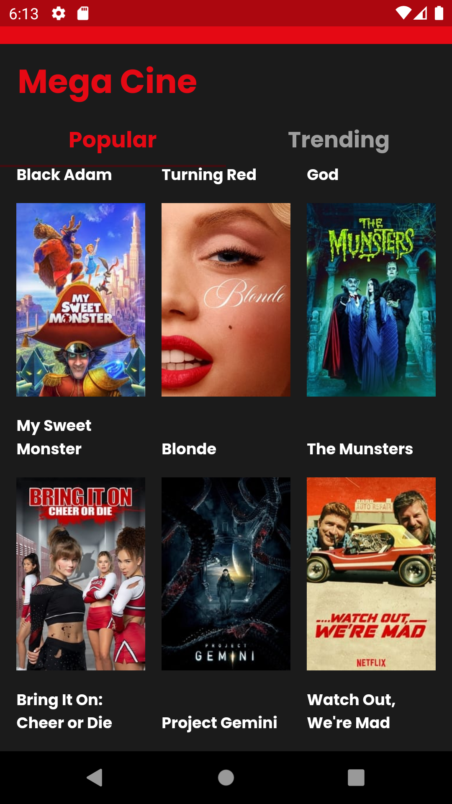
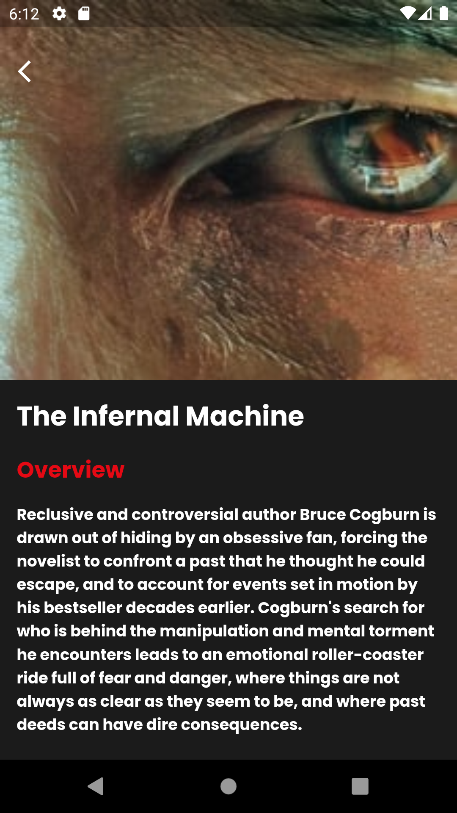
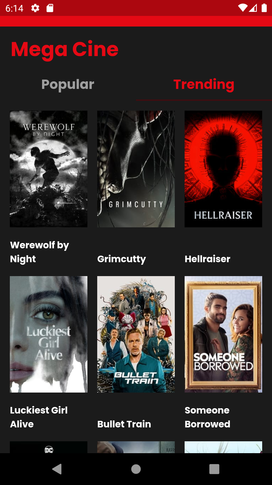
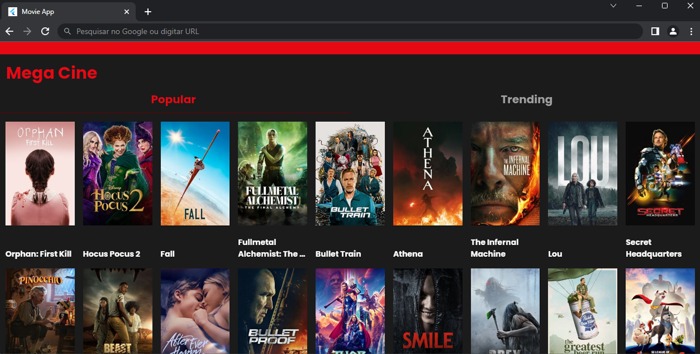

# 🎥 Movie App
## Sobre o projeto

Aplicativo para exibir filmes através da API The Movie Database (conhecida como TMDB). 
Nesse projeto é possível obter uma lista dos filmes populares atuais no TMDB, informações primárias sobre cada filme e, 
uma lista de tendências diárias.

## Layout 

### Tecnologias utilizadas

* Flutter
* API - The Movie Database (TMDB)
* Bloc

### Desenvolvedora

Jusy Lopes
https://www.linkedin.com/in/jusylopes
